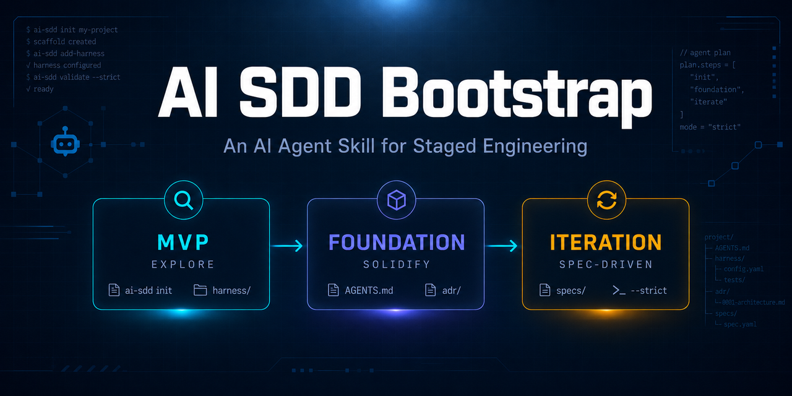

# AI SDD Bootstrap — AI Agent 分阶段工程化 Skill



> **这是一个 AI Agent Skill / CLI 工具。** 它为 AI 辅助软件项目提供分阶段脚手架：MVP 探索期保持轻量，架构稳定后再补充 Spec、ADR、Harness 的完整结构。
>
> 🇺🇸 [English README](README.md)

AI SDD Bootstrap 帮助你和 Codex、Claude Code、Kimi Code、Cursor、Copilot 等 AI agent 实践**规格驱动开发（Spec-Driven Development, SDD）**。它在正确的时间生成适量的结构，既不会在 MVP 阶段过度工程化，也不会在长期迭代中失去控制。

## 核心理念

- **MVP 阶段：** 快速移动、验证想法、避免过早写 spec。
- **Foundation 阶段：** MVP 跑通后，把架构和项目规则文档化。
- **Iteration 阶段：** 把稳定下来的决策用 spec 和可执行的 harness 锁住。

## 名字含义

**AI SDD Bootstrap** = **AI** + **SDD** + **Bootstrap**，三个词各自说明一件事：

- **AI** —— 这个工具是给用 AI agent（Claude Code、Cursor、Copilot 等）写代码的开发者用的，不是给纯手写代码的项目用的。
- **SDD（Spec-Driven Development，规格驱动开发）** —— 方法学核心。它的对立面是"vibe coding"（让 AI 凭感觉写）。SDD 主张把"已经想清楚、以后不再做第二次决定的事"写成规格（Spec），让 AI 每次重新加载上下文时都能拿到正确的规则，而不是靠概率猜。SDD 内部又分两类约束：
  - **Spec**（自然语言规格）= **软约束**，靠 AI 自觉读
  - **Harness**（可执行测试）= **硬约束**，跑不过就报错
- **Bootstrap（脚手架）** —— 软件工程里指"帮项目从零搭起最初的结构"，类似 `create-react-app` 或 `django-admin startproject`。本工具不替你写业务代码，只帮你搭好 docs/ADR/spec/harness 的目录骨架，并给出一套"什么时候写 spec、什么时候加 harness"的工作流。

合起来一句话：**一个给 AI 辅助开发的项目搭"规格驱动开发"脚手架的工具。**

它和一般脚手架的关键区别是**分阶段**——MVP 阶段刻意保持空白（只建 3 个文件），等过了 MVP 才动手建完整结构。因为过早写 spec 是"伪装成严谨的拖延"，会把猜测变成枷锁。详见下面的"阶段指南"。

## 什么时候用

满足以下任一情况时使用本 skill：

- 你正在用 AI 辅助启动一个新项目。
- MVP 已经跑通，你想防止后续 AI 改动破坏既有行为。
- 你需要一套可复用的结构来组织 ADR、feature spec 和 harness 测试。
- 你希望不同的 AI agent（Claude Code、Cursor、Copilot 等）在不同会话里都读到同一份项目规则。

一次性原型项目的最初阶段不要上完整框架，只跑 `init` 即可。

## 安装

### 通过 pip（推荐）

```bash
pip install git+https://github.com/Goldloli/ai-sdd-bootstrap.git
```

安装后会得到 `ai-sdd` 命令：

```bash
ai-sdd --help
```

### 本地开发安装

```bash
git clone https://github.com/Goldloli/ai-sdd-bootstrap.git
cd ai-sdd-bootstrap
pip install -e .
```

> **注意 PEP 668**：在 macOS、新版 Ubuntu / Debian 等 externally-managed 的 Python 环境下，`pip install` 会被拒绝。任选一种方式绕开：
>
> - 用虚拟环境：`python3 -m venv .venv && source .venv/bin/activate && pip install -e .`
> - 用 `pipx`：`pipx install git+https://github.com/Goldloli/ai-sdd-bootstrap.git`
> - 或显式放行：`pip install -e . --break-system-packages`（不推荐用于系统 Python）

### 作为 skill 让 agent 自动安装

最省事的方式是直接对你的 AI agent 说一句话，让它自己装，例如：

```text
帮我装一下这个 skill：https://github.com/Goldloli/ai-sdd-bootstrap
```

agent 会自动 clone 到自己的 skill 目录（通常是 `~/.agents/skills/ai-sdd-bootstrap`），之后就能用 `ai-sdd` 命令，或者通过自然语言触发（"初始化一个 MVP 项目" / "给这个功能加个 harness" 等等）。

如果你更愿意手动放，直接 clone 到 skill 目录即可：

```bash
git clone https://github.com/Goldloli/ai-sdd-bootstrap.git ~/.agents/skills/ai-sdd-bootstrap
```

以下文档统一使用 `ai-sdd`。如果你是直接调脚本，把 `ai-sdd` 替换成 `python3 ~/.agents/skills/ai-sdd-bootstrap/scripts/ai_sdd_bootstrap.py` 即可。

## 支持的技术栈

- `nodejs-ts`
- `python`
- `rust`
- `go`
- `language-agnostic`
- `shell`

可以选择一个主栈和若干附加栈。

## 推荐工作流

### 1. 启动一个新的 MVP

在项目根目录下运行：

```bash
ai-sdd init
```

非交互示例：

```bash
ai-sdd init \
  --primary-stack nodejs-ts
```

它只会创建：

```text
AGENTS.md
README.md
.gitignore
```

它**故意不**创建 `docs/`、`CLAUDE.md`、`AI_HANDOFF.md` 或 harness 文件。MVP 还是一份草稿，不要过早用流程把它埋掉。

### 2. 在 MVP 验证通过前自由构建

MVP 阶段：

- 让 AI 探索实现方案。
- 保持代码小、易于改动。
- 避免写大量 spec。
- 只记录真正已经锁定的决策。

可以进入下一阶段的信号：

- 你已经以真实用户身份用过 MVP。
- 产品方向不再每小时都在变。
- 你能说清楚主要模块和边界。
- 你开始担心 AI 在加新功能时把旧行为改坏。

### 3. 引导 Foundation 框架

MVP 验证通过后，运行：

```bash
ai-sdd bootstrap-foundation
```

非交互示例：

```bash
ai-sdd bootstrap-foundation \
  --primary-stack nodejs-ts \
  --additional-stack python
```

这会创建完整的 SDD 结构：

```text
docs/
  INDEX.md
  adr/
  feature/
  guide/
    ai-behavior.md
    project-meta.md
  examples/
AGENTS.md
AI_HANDOFF.md
CLAUDE.md
README.md
```

从这一刻起，agent 在做出实质性改动前，应该先读 `AGENTS.md`、`CLAUDE.md`、`AI_HANDOFF.md` 和 `docs/guide/ai-behavior.md`。

### 4. 查看项目状态

任何时候都可以运行：

```bash
ai-sdd status
```

它会报告：

- 项目是否已初始化。
- Foundation 框架是否存在。
- 当前阶段。
- ADR 数量。
- Feature spec 数量。
- Harness 数量。
- Git 分支和未提交文件。
- 推荐的下一步动作。

## 常用命令

### 添加 ADR

当某个架构决策不应该被每次新 AI 会话重新争论时，就写一条 ADR。

交互式：

```bash
ai-sdd add-adr
```

非交互式：

```bash
ai-sdd add-adr \
  --title "Use SQLite For Local Storage" \
  --background "The desktop app needs reliable local persistence." \
  --decision "Use SQLite as the local persistence layer." \
  --consequences "Simple local-first storage, but not a multi-user database." \
  --status accepted
```

这会在 `docs/adr/` 下创建文件，并更新 `docs/INDEX.md`。

### 添加 Feature Spec

当某个行为或边界已经稳定下来时，写一条 feature spec。

交互式：

```bash
ai-sdd add-spec
```

非交互式：

```bash
ai-sdd add-spec \
  --title "Login Flow" \
  --in-scope "Email and password login" \
  --out-scope "Social login, password reset" \
  --boundaries "Do not bypass password verification,Do not mutate user roles during login" \
  --acceptance "Reject wrong password,Create session for valid credentials" \
  --dependencies "ADR-001-use-sqlite-for-local-storage.md"
```

这会在 `docs/feature/` 下创建文件，并更新 `docs/INDEX.md`。

### 添加 Harness

当某个行为重要到需要用可执行检查来强制时，就加一个 harness。

交互式：

```bash
ai-sdd add-harness
```

非交互式：

```bash
ai-sdd add-harness \
  --stack nodejs-ts \
  --title "Login Rejects Wrong Password" \
  --module auth \
  --purpose "Lock the invariant that invalid credentials never create a session." \
  --related-spec docs/feature/login-flow.md \
  --kind test
```

重要：生成的 harness 是**草稿约束**。它们故意失败，直到你把占位符替换为真实的 setup、输入和断言。在替换之前，不要把它算作覆盖。

生成路径：

```text
nodejs-ts -> tests/harness/<module>/<name>.spec.ts
python    -> tests/harness/<module>/test_<name>.py
rust      -> tests/harness/<module>/<name>.rs
go        -> tests/harness/<module>/<name>_test.go
shell     -> tests/harness/<module>/<name>.sh
```

Harness 类型（`--kind`）：

- `test`（默认）—— 单不变量的单元 harness，每个文件对应一种栈。
- `evaluation` —— 固定任务集 + 评分器 + 通过阈值，适合 LLM / agent 质量（目前只有 python 模板）。
- `scenario` —— 完整工作流，带期望轨迹和禁止副作用（目前只有 python 模板）。

`--related-spec` 会在 harness 文件头部写入一行 `Related spec:`。`status` 用这些显式声明（以 stem 匹配作为回退）来报告哪些 spec 还缺少硬约束。

### 架构评审

MVP 跑通后，让工具生成一份架构评审文档：

```bash
ai-sdd review-architecture
```

它会扫描源码文件并写出：

```text
docs/guide/architecture-review.md
```

把结果当作和 AI 讨论的素材，不要盲目按它列的所有项重构。

### 建议 Harness 候选

寻找适合加 harness 的位置：

```bash
ai-sdd suggest-harness
```

工具使用的启发式包括：

- 核心流程名称：`auth`、`login`、`payment`、`permission`、`security`。
- 最近 git 历史中反复被修改的文件。
- 大文件。
- 函数很多的文件。
- 带 TODO/FIXME/HACK 标记的文件。

把输出当作建议，而不是命令。

非交互式用法：

```bash
# 自动对 top 1 候选生成 harness（适合 AI agent 调用）
ai-sdd suggest-harness --top 1

# 只列出候选，不写文件
ai-sdd suggest-harness --dry-run
```

### 校验项目健康度

检查 INDEX 链接、spec 与 harness 是否一致：

```bash
ai-sdd validate
```

它会报告 `docs/INDEX.md` 中的死链、仍处于 draft 状态的 harness，以及没有 harness 的 spec。

给 AI agent 消费：

```bash
ai-sdd validate --json
```

## AI Agent 专用参数

所有会写文件的命令都支持 `--dry-run`（只预览不写文件）和 `--strict`（缺参数时直接失败，而不是静默使用默认值）。AI agent 调用时建议加上：

```bash
ai-sdd init --primary-stack python --dry-run
ai-sdd add-adr --strict --title "Use SQLite" --background "..." --decision "..." --consequences "..."
```

`status` 和 `validate` 支持 `--json`，方便 agent 直接解析。

## 每个文件的用途

| 文件或目录 | 用途 |
|---|---|
| `AGENTS.md` | AI agent 的入口指令。 |
| `CLAUDE.md` | Claude 专用的项目宪章。 |
| `AI_HANDOFF.md` | 当前项目状态，给新 AI 会话看。 |
| `docs/INDEX.md` | spec 和 ADR 的导航地图。 |
| `docs/guide/ai-behavior.md` | 必读的 AI 协作规则。 |
| `docs/guide/project-meta.md` | 栈、阶段、harness 元信息。 |
| `docs/adr/` | 架构决策记录。 |
| `docs/feature/` | Feature spec 和稳定的行为边界。 |
| `tests/harness/` | 重要不变量的可执行检查。 |

## 阶段指南

| 阶段 | 优化目标 | 应避免 |
|---|---|---|
| MVP | 端到端能跑通 | 沉重的文档、大而全的 spec、虚假的架构确定性 |
| Foundation | 模块边界、ADR、项目规则 | 给所有东西都套上 harness |
| Iteration | 稳定的 spec、精准的 harness、安全的改动 | 文档和代码脱节 |

## 正确用法示例

好的 MVP 用法：

```bash
ai-sdd init --primary-stack nodejs-ts
```

然后自由构建，直到想法被验证。

好的 foundation 用法：

```bash
ai-sdd bootstrap-foundation --primary-stack nodejs-ts
ai-sdd review-architecture
ai-sdd add-adr
```

好的 iteration 用法：

```bash
ai-sdd add-spec
ai-sdd add-harness
ai-sdd status
```

## 常见错误

### 错误：过早跑 `bootstrap-foundation`

如果产品方向还在剧烈变化，就留在 MVP 阶段。过早的 spec 会变成围绕猜测的约束。

### 错误：把生成的 harness 当成真实覆盖

生成的 harness 文件是故意失败的。在算作覆盖前，必须把占位符替换为真实测试。

### 错误：给每个想法都写 spec

Spec 是给已经验证过、或有意锁定的决策用的。如果想法还只是猜测，就先别写进 spec。

### 错误：把所有文档都塞进每次 AI 会话

这套框架是为按需加载设计的。先读索引，再加载相关的 ADR 和 spec。

### 错误：让 `AI_HANDOFF.md` 腐烂

在重要的规划会话或交接之前更新它。它应该反映当前焦点、近期决策、待解决问题、下一步。

## 典型的人类提示词示例

向 AI agent 提问：

```text
Use the ai-sdd-bootstrap skill to initialize this project for MVP exploration.
```

```text
The MVP is validated. Use ai-sdd-bootstrap to bootstrap the foundation framework.
```

```text
Use ai-sdd-bootstrap to add an ADR for choosing SQLite as local storage.
```

```text
Use ai-sdd-bootstrap to suggest where this project needs harness tests.
```

```text
Use ai-sdd-bootstrap to add a harness for the login rejection behavior.
```

## 维护清单

每完成一个有意义的功能后：

1. 想一想有没有哪个决策现在已经稳定下来。
2. 如果有，添加或更新一条 feature spec。
3. 想一想破坏这个行为的代价是否很高、或是否很难被发现。
4. 如果是，加一个真实的 harness。
5. 如果项目方向、当前焦点或待解决问题发生了变化，更新 `AI_HANDOFF.md`。
6. 跑 `status` 看看项目还缺什么。

## 速查

```bash
# 仅 MVP
ai-sdd init --primary-stack nodejs-ts

# MVP 验证通过后
ai-sdd bootstrap-foundation --primary-stack nodejs-ts

# 查看当前状态
ai-sdd status

# 记录一条架构决策
ai-sdd add-adr

# 记录一条稳定的功能边界
ai-sdd add-spec

# 生成一个需要手动填充的草稿 harness
ai-sdd add-harness

# 生成架构评审笔记
ai-sdd review-architecture

# 寻找适合加 harness 的位置
ai-sdd suggest-harness --top 1
```

## 贡献

欢迎 Issue 和 Pull Request。开发环境：

```bash
git clone https://github.com/Goldloli/ai-sdd-bootstrap.git
cd ai-sdd-bootstrap
pip install -e '.[dev]'
pytest
```

详见 [CONTRIBUTING.md](CONTRIBUTING.md)。

## 许可

MIT。详见 [LICENSE](LICENSE)。

## 致谢

本 skill 的方法论源自 B 站 UP 主 [**AI 林湛星**](https://space.bilibili.com/395922059) 的「AI 编程工程化」系列视频。系列围绕真实项目 `pet-claw`（AniPal，4 个月开发、11 万行源码、近 50 条 ADR、上千个自动化测试）展开，系统讨论了个人开发者在 AI 编程时代如何让项目从 0 到 1、再从 1 到 10 持续迭代而不烂尾。

核心理念——**Spec 是软约束、Harness 是硬约束、MVP 阶段放开抡、过了 MVP 才建地基**——均来自该系列。本仓库将其落成了可执行的 CLI 工具。

如果你觉得这套方法对你有帮助，强烈推荐去 [原作者 B 站主页](https://space.bilibili.com/395922059) 看完整系列视频。

